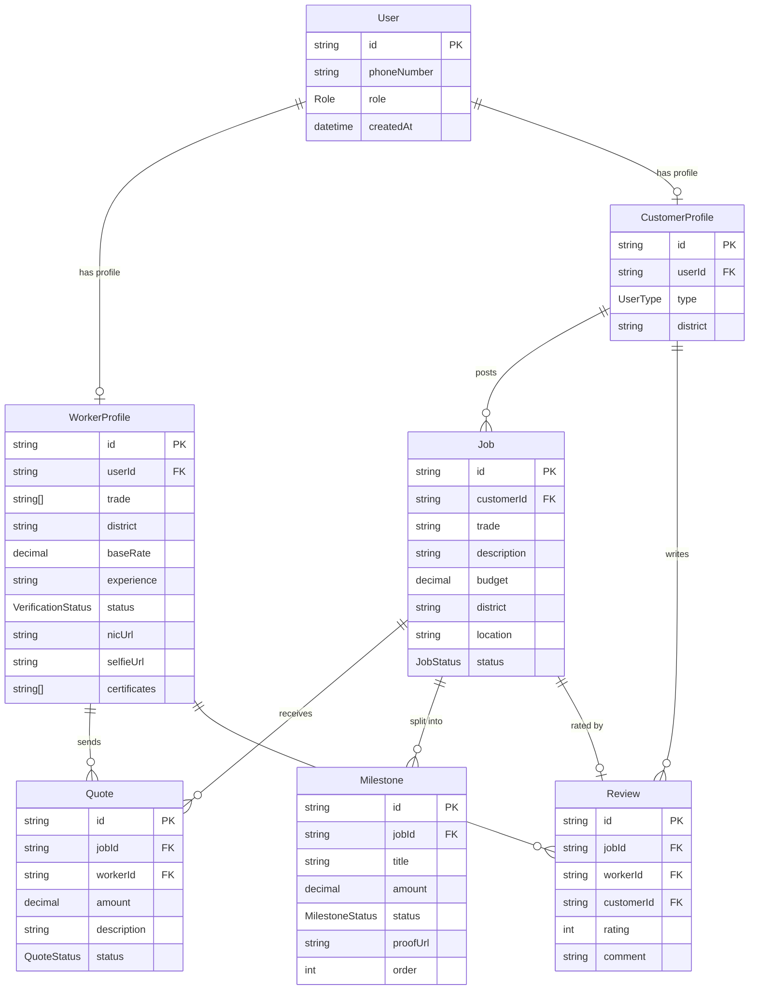

# Baas.lk Database ERD

```mermaid
erDiagram
    User ||--o| WorkerProfile : "has profile"
    User ||--o| CustomerProfile : "has profile"
    
    CustomerProfile ||--o{ Job : posts
    WorkerProfile ||--o{ Quote : sends
    Job ||--o{ Quote : receives
    Job ||--o{ Milestone : "split into"
    Job ||--o| Review : "rated by"
    
    WorkerProfile ||--o{ Review : "reviewed by"
    CustomerProfile ||--o{ Review : writes

    User {
        string id PK
        string phoneNumber
        Role role
        datetime createdAt
    }

    WorkerProfile {
        string id PK
        string userId FK
        string[] trade
        string district
        decimal baseRate
        string experience
        VerificationStatus status
        string nicUrl
        string selfieUrl
        string[] certificates
    }

    CustomerProfile {
        string id PK
        string userId FK
        UserType type
        string district
    }

    Job {
        string id PK
        string customerId FK
        string trade
        string description
        decimal budget
        string district
        string location
        JobStatus status
    }

    Quote {
        string id PK
        string jobId FK
        string workerId FK
        decimal amount
        string description
        QuoteStatus status
    }

    Milestone {
        string id PK
        string jobId FK
        string title
        decimal amount
        MilestoneStatus status
        string proofUrl
        int order
    }

    Review {
        string id PK
        string jobId FK
        string workerId FK
        string customerId FK
        int rating
        string comment
    }
```
